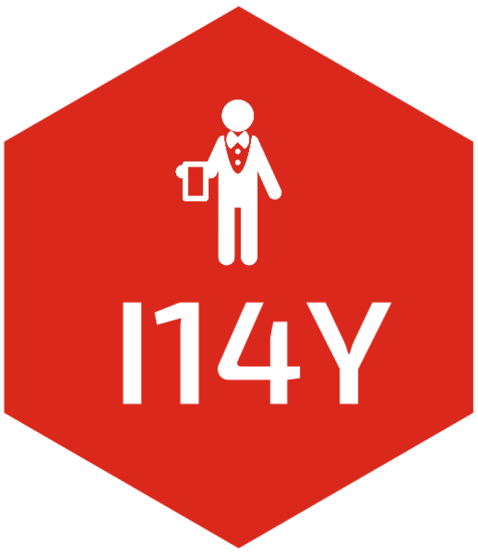

<!-- README.md is generated from README.Rmd. Please edit that file -->

# I14Y 

<!-- badges: start -->

[](https://CRAN.R-project.org/package=I14Y)
[](https://cran.r-project.org/package=I14Y)
[](https://github.com/lgnbhl/I14Y/actions/workflows/R-CMD-check.yaml)
[](https://www.linkedin.com/in/FelixLuginbuhl)
<!-- badges: end -->

Search and download official Swiss metadata from the [I14Y
interoperability plateform](https://www.i14y.admin.ch) of Switzerland
using its public [IOP API](https://www.i14y.admin.ch/api/index.html) and
[Console API](https://apiconsole.i14y.admin.ch/public/v1/index.html) in
any language (“en”, “de”, “fr” or “it”).

## Installation

You can install the development version of **I14Y** like so:

``` r
# install.packages("remotes")
remotes::install_github("lgnbhl/I14Y")
```

## Usage

``` r
library(I14Y)
```

### Get concepts and codelists

You can get the full concept public catalog with
`i14y_search_concept()`:

``` r
i14y_search_concept()
#> # A tibble: 444 × 13
#>    conceptType id        identifier registrationStatus validFrom validTo version
#>    <chr>       <chr>     <chr>      <chr>              <chr>     <chr>   <chr>  
#>  1 Numeric     08dbcbbc… AHVN13     Preferred Standard 2007-11-… <NA>    1.0.0  
#>  2 CodeList    08db65be… AJOURNEME… Recorded           1996-12-… <NA>    1.0.0  
#>  3 Numeric     08db65bf… AJOURNEME… Recorded           1996-12-… <NA>    1.0.0  
#>  4 CodeList    08dc0def… ANHVO      Recorded           2018-03-… <NA>    1.0.0  
#>  5 CodeList    08db556b… ANTICIPAT… Recorded           1996-12-… <NA>    1.0.0  
#>  6 Numeric     08dc5e21… AZCHS      Recorded           2018-03-… <NA>    1.0.0  
#>  7 CodeList    08dca65f… BLW_CD_CD… Recorded           2001-02-… 2023-1… 1.0.0  
#>  8 CodeList    08dcab1f… BLW_CD_DZ… Recorded           2023-12-… <NA>    1.0.0  
#>  9 CodeList    08dcabe2… BLW_CD_DZ… Recorded           2023-12-… <NA>    1.0.0  
#> 10 CodeList    08dcab1c… BLW_CD_DZ… Recorded           2023-12-… <NA>    1.0.0  
#> # ℹ 434 more rows
#> # ℹ 6 more variables: agencyName.cultureCode <chr>, agencyName.text <chr>,
#> #   description.cultureCode <chr>, description.text <chr>,
#> #   name.cultureCode <chr>, name.text <chr>
```

Search for a specific concept in a given language (“en”, “de”, “fr” or
“it”) with `i14y_search_concept()`:

``` r
i14y_search_concept(search = "noga", language = "en")
#> # A tibble: 9 × 13
#>   conceptType id         identifier registrationStatus validFrom validTo version
#>   <chr>       <chr>      <chr>      <chr>              <chr>     <lgl>   <chr>  
#> 1 CodeList    08dc481b-… DV_NOGA_2… Preferred Standard 2024-03-… NA      1.0.0  
#> 2 CodeList    08d94604-… DV_NOGA_C… Preferred Standard 2007-12-… NA      3.0.0  
#> 3 CodeList    08d94604-… DV_NOGA_D… Preferred Standard 2007-12-… NA      3.0.0  
#> 4 CodeList    08d9f6dd-… DV_NOGA_E… Recorded           2007-12-… NA      1.0.0  
#> 5 CodeList    08d94604-… DV_NOGA_G… Preferred Standard 2007-12-… NA      3.0.0  
#> 6 CodeList    08d94604-… DV_NOGA_O… Recorded           2007-12-… NA      3.0.0  
#> 7 CodeList    08d94603-… DV_NOGA_S… Preferred Standard 2007-12-… NA      3.0.0  
#> 8 CodeList    08d9f1f9-… DV_NOGA_S… Recorded           2007-12-… NA      1.0.0  
#> 9 CodeList    08d94604-… DV_NOGA_T… Preferred Standard 2007-12-… NA      3.1.0  
#> # ℹ 6 more variables: agencyName.cultureCode <chr>, agencyName.text <chr>,
#> #   description.cultureCode <chr>, description.text <chr>,
#> #   name.cultureCode <chr>, name.text <chr>
```

As showed in the `conceptType` column, some concepts have the type
“CodeList”. You can get the codelist (i.e. the “content”) of a concept
using `i14y_get_codelist()`, with the value from the `id` column.

``` r
i14y_get_codelist(
  id = "08d94604-e058-62a2-aa25-53f84b974201" # for DV_NOGA_DIVISION
)
#> # A tibble: 88 × 48
#>    Code  ParentCode Name_de       Name_fr Name_it Name_rm Name_en Description_de
#>    <chr> <lgl>      <chr>         <chr>   <chr>   <lgl>   <chr>   <lgl>         
#>  1 01    NA         Landwirtscha… Cultur… Produz… NA      Crop a… NA            
#>  2 02    NA         Forstwirtsch… Sylvic… Silvic… NA      Forest… NA            
#>  3 03    NA         Fischerei un… Pêche … Pesca … NA      Fishin… NA            
#>  4 05    NA         Kohlenbergbau Extrac… Estraz… NA      Mining… NA            
#>  5 06    NA         Gewinnung vo… Extrac… Estraz… NA      Extrac… NA            
#>  6 07    NA         Erzbergbau    Extrac… Estraz… NA      Mining… NA            
#>  7 08    NA         Gewinnung vo… Autres… Altre … NA      Other … NA            
#>  8 09    NA         Erbringung v… Servic… Attivi… NA      Mining… NA            
#>  9 10    NA         Herstellung … Indust… Indust… NA      Manufa… NA            
#> 10 11    NA         Getränkehers… Fabric… Produz… NA      Manufa… NA            
#> # ℹ 78 more rows
#> # ℹ 40 more variables: Description_fr <lgl>, Description_it <lgl>,
#> #   Description_rm <lgl>, Description_en <lgl>, Annotation_ABBREV_Type <chr>,
#> #   Annotation_ABBREV_Title <lgl>, Annotation_ABBREV_URI <lgl>,
#> #   Annotation_ABBREV_Identifier <lgl>, Annotation_ABBREV_Text_de <chr>,
#> #   Annotation_ABBREV_Text_fr <chr>, Annotation_ABBREV_Text_it <chr>,
#> #   Annotation_ABBREV_Text_rm <lgl>, Annotation_ABBREV_Text_en <chr>, …
```

You can also get all concept metadata using `i14_get_concept()`. Note
that the object returned is a list (not a data.frame).

``` r
concept_list <- i14y_get_concept(
  id = "08d94604-e058-62a2-aa25-53f84b974201"
)

concept_list$description
#> $cultureCode
#> [1] "de"
#> 
#> $text
#> [1] "Zweite Ebene der Allgemeinen Systematik der Wirtschaftszweige (NOGA), bestehend aus Rubriken, die durch einen zweistelligen numerischen Code gekennzeichnet sind. Diese zweite Ebene wird durch die International Standard Industrial Classification of All Economic Activities (ISIC Rev.4) bestimmt."
```

### A concrete example

When using an official Swiss dataset, you can use I14Y to get
translations or additional information for a given category. For
example, let’s get the monthly income by gender and profession in 2022
using the BFS R package.

``` r
library(BFS)

income_by_job_and_gender_meta <- BFS::bfs_get_metadata(
  number_bfs = "px-x-0304010000_201"
)

income_by_job_and_gender <- BFS::bfs_get_data(
  number_bfs = "px-x-0304010000_201", 
  language = "de",
  query = list(
    Jahr = "2022", 
    Geschlecht = c("1", "2"),
    Wirtschaftsabteilung = income_by_job_and_gender_meta$values[[3]],
    'Zentralwert und andere Perzentile' = "1"
  )
)

income_by_job_and_gender
#> # A tibble: 164 × 5
#>    Jahr  Wirtschaftsabteilung                  Geschlecht Zentralwert und ande…¹
#>    <chr> <chr>                                 <chr>      <chr>                 
#>  1 2022  Wirtschaftsabteilung - Total          Frauen     Zentralwert           
#>  2 2022  Wirtschaftsabteilung - Total          Männer     Zentralwert           
#>  3 2022  05-43 Sektor 2: Produktion            Frauen     Zentralwert           
#>  4 2022  05-43 Sektor 2: Produktion            Männer     Zentralwert           
#>  5 2022  > 8 Gewinnung von Steinen und Erden,… Frauen     Zentralwert           
#>  6 2022  > 8 Gewinnung von Steinen und Erden,… Männer     Zentralwert           
#>  7 2022  > 9 Erbringung von Dienstleistungen … Frauen     Zentralwert           
#>  8 2022  > 9 Erbringung von Dienstleistungen … Männer     Zentralwert           
#>  9 2022  > 10 Herstellung von Nahrungs- und F… Frauen     Zentralwert           
#> 10 2022  > 10 Herstellung von Nahrungs- und F… Männer     Zentralwert           
#> # ℹ 154 more rows
#> # ℹ abbreviated name: ¹​`Zentralwert und andere Perzentile`
#> # ℹ 1 more variable: `Monatlicher Bruttolohn` <dbl>
```

Using I14Y, you can get the English, French or Italian translation of
the German NOGA division categories (with a bit of extra data
transformations):

``` r
library(dplyr)
library(stringr)
library(readr)

noga_division <- i14y_get_codelist(
  id = "08d94604-e058-62a2-aa25-53f84b974201" # for DV_NOGA_DIVISION
) |>
  mutate(Code = as.numeric(Code))

income_by_job_and_gender |>
  filter(!str_detect(Wirtschaftsabteilung, "Sektor")) |> # remove sectors
  mutate(Code = readr::parse_number(Wirtschaftsabteilung)) |> # extract code
  left_join(noga_division, by = "Code") |>
  select(Wirtschaftsabteilung, Name_en, Name_fr, Name_it)
#> # A tibble: 160 × 4
#>    Wirtschaftsabteilung                                  Name_en Name_fr Name_it
#>    <chr>                                                 <chr>   <chr>   <chr>  
#>  1 Wirtschaftsabteilung - Total                          <NA>    <NA>    <NA>   
#>  2 Wirtschaftsabteilung - Total                          <NA>    <NA>    <NA>   
#>  3 > 8 Gewinnung von Steinen und Erden, sonstiger Bergb… Other … Autres… Altre …
#>  4 > 8 Gewinnung von Steinen und Erden, sonstiger Bergb… Other … Autres… Altre …
#>  5 > 9 Erbringung von Dienstleistungen für den Bergbau … Mining… Servic… Attivi…
#>  6 > 9 Erbringung von Dienstleistungen für den Bergbau … Mining… Servic… Attivi…
#>  7 > 10 Herstellung von Nahrungs- und Futtermitteln      Manufa… Indust… Indust…
#>  8 > 10 Herstellung von Nahrungs- und Futtermitteln      Manufa… Indust… Indust…
#>  9 > 11 Getränkeherstellung                              Manufa… Fabric… Produz…
#> 10 > 11 Getränkeherstellung                              Manufa… Fabric… Produz…
#> # ℹ 150 more rows
```

### Search and get datasets

You can search in the public catalog for datasets, data services or
public services with `i14y_search_catalog()`:

``` r
i14y_search_catalog()
#> # A tibble: 124 × 13
#>    formats   identifier   registrationStatus themes type  accessRights.culture…¹
#>    <list>    <chr>        <chr>              <list> <chr> <chr>                 
#>  1 <chr [0]> 0aaed69d-15… Recorded           <df>   Data… de                    
#>  2 <chr [0]> 15d720d4-dc… Recorded           <df>   Data… de                    
#>  3 <chr [0]> 14e60ad3-1c… Recorded           <df>   Data… de                    
#>  4 <chr [0]> 1f975f0e-68… Recorded           <df>   Data… de                    
#>  5 <chr [0]> 08b7a45f-c1… Recorded           <df>   Data… de                    
#>  6 <chr [0]> 404387b5-ff… Recorded           <df>   Data… de                    
#>  7 <chr [0]> 78b4df19-0b… Recorded           <df>   Data… de                    
#>  8 <chr [0]> 4cfcb1da-0f… Recorded           <df>   Data… de                    
#>  9 <chr [0]> 6ef8f5d2-3d… Recorded           <df>   Data… de                    
#> 10 <chr [0]> 6516adf7-a2… Recorded           <df>   Data… de                    
#> # ℹ 114 more rows
#> # ℹ abbreviated name: ¹​accessRights.cultureCode
#> # ℹ 7 more variables: accessRights.text <chr>, description.cultureCode <chr>,
#> #   description.text <chr>, publisher.cultureCode <chr>, publisher.text <chr>,
#> #   title.cultureCode <chr>, title.text <chr>
```

Note that the “type” column returned by `i14y_search_catalog()` shows if
the content is a “Dataset”, a “DataService” or a “PublicService”.

You can get the description of a given “Dataset” with
`i14y_get_dataset_description()`.

``` r
dataset_description <- i14y_get_dataset_description(
  identifier = "EPD_Metadaten",  
  language = "en"
)

dataset_description$description$text
#> [1] "Im Kontext des digitalen Austausches von medizinischen Informationen zwischen den Behandelnden ist eine Analogie mit dem Briefverkehr hilfreich. Die notwendigen Informationen auf einem Briefumschlag wie Absender, Adressatin und eventuell die nähere Bezeichnung des Briefinhaltes sind vergleichbar mit den Metadaten, die einem elektronischen Dokument angefügt werden. Anhand dieser Informationen können die IT-Systeme – quasi als elektronische Briefträger – den Transport, die Ablage und die Abfrage automatisch bewerkstelligen."
```

Some datasets can be access directly using the I14Y API. But other
datasets are hosted only on partner websites. You can get the URL
downloads and formats of the dataset using
`i14y_get_dataset_distributions()`:

``` r
dataset_distributions <- i14y_get_dataset_distributions(
  identifier = "HCL_CH_ISCO_19_PROF_1_2_2",  
  language = "en"
)
# see "downloadUrl" and "format" columns
str(dataset_distributions, max.level = 1)
#> 'data.frame':    5 obs. of  27 variables:
#>  $ accessUrl              :List of 5
#>  $ availability           : logi  NA NA NA NA NA
#>  $ byteSize               : num  2000000 49 49 49 4862000
#>  $ checksum               : logi  NA NA NA NA NA
#>  $ conformsTo             :List of 5
#>  $ coverage               :List of 5
#>  $ documentation          :List of 5
#>  $ downloadUrl            :List of 5
#>  $ id                     : chr  "02b188f4-72ef-4458-8e32-092f100e4ec4" "60235fc5-5d18-4821-9c28-731fb812602e" "7cba5165-aae7-4565-a62c-68795ddb9262" "ac6e33db-e048-410f-8206-ad9b24a6c587" ...
#>  $ identifier             : logi  NA NA NA NA NA
#>  $ image                  :List of 5
#>  $ language               :List of 5
#>  $ license                : logi  NA NA NA NA NA
#>  $ mediaType              : logi  NA NA NA NA NA
#>  $ modified               : chr  "2024-11-06T00:00:00+01:00" "2024-11-14T00:00:00+01:00" "2024-04-02T00:00:00+02:00" "2024-04-02T00:00:00+02:00" ...
#>  $ packagingFormat        : logi  NA NA NA NA NA
#>  $ releaseDate            : chr  "2024-11-06T00:00:00+01:00" "2024-04-02T00:00:00+02:00" "2024-04-02T00:00:00+02:00" "2024-04-02T00:00:00+02:00" ...
#>  $ rights                 : logi  NA NA NA NA NA
#>  $ spatialResolution      :List of 5
#>  $ status                 :List of 5
#>  $ temporalResolution     : logi  NA NA NA NA NA
#>  $ description.cultureCode: chr  "en" "en" "en" "en" ...
#>  $ description.text       : chr  "Auswahl an Berufsbezeichnungen für den Einsatz in Web- oder Telefonumfragen und andere Online-Formulare. Diese "| __truncated__ "Die Schweizer Berufsnomenklatur CH-ISCO-19 übernimmt die vier ersten Ebenen der Internationalen Standardklassif"| __truncated__ "Die Schweizer Berufsnomenklatur CH-ISCO-19 übernimmt die vier ersten Ebenen der Internationalen Standardklassif"| __truncated__ "Die Schweizer Berufsnomenklatur CH-ISCO-19 übernimmt die vier ersten Ebenen der Internationalen Standardklassif"| __truncated__ ...
#>  $ format.cultureCode     : chr  "en" "en" "en" "en" ...
#>  $ format.text            : chr  "Excel XLSX" "Excel XLSX" "Excel XLSX" "Excel XLSX" ...
#>  $ title.cultureCode      : chr  "en" "en" "en" "en" ...
#>  $ title.text             : chr  "Auswahl an Berufsbezeichnungen für Umfragen v.1.2.2" "Schweizer Berufsnomenklatur CH-ISCO-19 v.1.2" "Schweizer Berufsnomenklatur CH-ISCO-19 v.1.2" "Schweizer Berufsnomenklatur CH-ISCO-19 v.1.2" ...
```

We see using `i14y_get_dataset_distributions()` that the dataset above
is accessible using the Nomenclatures endpoint of the I14Y API. You can
get a nomenclature dataset level with `i14y_get_nomenclature_level()`.

``` r
i14y_get_nomenclature_level(
  identifier = "HCL_NOGA",
  level = 2,
  language = "de"
)
#> # A tibble: 88 × 3
#>    Code  Parent Name_de                                                         
#>    <chr> <chr>  <chr>                                                           
#>  1 01    A      Landwirtschaft, Jagd und damit verbundene Tätigkeiten           
#>  2 02    A      Forstwirtschaft und Holzeinschlag                               
#>  3 03    A      Fischerei und Aquakultur                                        
#>  4 05    B      Kohlenbergbau                                                   
#>  5 06    B      Gewinnung von Erdöl und Erdgas                                  
#>  6 07    B      Erzbergbau                                                      
#>  7 08    B      Gewinnung von Steinen und Erden, sonstiger Bergbau              
#>  8 09    B      Erbringung von Dienstleistungen für den Bergbau und für die Gew…
#>  9 10    C      Herstellung von Nahrungs- und Futtermitteln                     
#> 10 11    C      Getränkeherstellung                                             
#> # ℹ 78 more rows
```

You can get nomenclature multi levels with
`i14y_get_nomenclature_level_multi()`:

``` r
# https://www.i14y.admin.ch/fr/catalog/datasets/HCL_CH_ISCO_19_PROF_1_2_2
i14y_get_nomenclature_level_multiple(
  identifier = "HCL_NOGA",
  levelFrom = 1,
  levelTo = 2,
  language = "de"
)
#> # A tibble: 109 × 4
#>    Abschnitt Abteilung Code  Name_de                                            
#>    <chr>     <chr>     <chr> <chr>                                              
#>  1 A         <NA>      A     LAND- UND FORSTWIRTSCHAFT, FISCHEREI               
#>  2 <NA>      01        01    Landwirtschaft, Jagd und damit verbundene Tätigkei…
#>  3 <NA>      02        02    Forstwirtschaft und Holzeinschlag                  
#>  4 <NA>      03        03    Fischerei und Aquakultur                           
#>  5 B         <NA>      B     BERGBAU UND GEWINNUNG VON STEINEN UND ERDEN        
#>  6 <NA>      05        05    Kohlenbergbau                                      
#>  7 <NA>      06        06    Gewinnung von Erdöl und Erdgas                     
#>  8 <NA>      07        07    Erzbergbau                                         
#>  9 <NA>      08        08    Gewinnung von Steinen und Erden, sonstiger Bergbau 
#> 10 <NA>      09        09    Erbringung von Dienstleistungen für den Bergbau un…
#> # ℹ 99 more rows
```

You can also search within a nomenclature:

``` r
i14y_search_nomenclature(
  identifier = "HCL_NOGA",
  query = "agriculture",
  language = "fr"
)
#>                                                                                                                                                                                                                                                                                                                                                                                                                                                                               annotations
#> 1                                                                                                              NA, NA, 0, 0, , , ABBREV, INCLUDES, , , fr, fr, AGRICULT., SYLVICULT. ET PÊCHE, Cette section couvre l'exploitation des ressources naturelles végétales et animales et comprend les activités de culture, d'élevage, de récolte de bois et d'autres plantes et de production d'animaux ou de produits animaux dans une exploitation agricole ou dans leur habitat naturel.
#> 2 NA, NA, 0, 0, , , ABBREV, INCLUDES, , , fr, fr, Activ. de soutien à l'agriculture, Ce groupe comprend les activités annexes à la production agricole et les activités similaires à l'agriculture qui ne sont pas effectuées à des fins de production (dans le sens de récolter des produits agricoles) et qui sont exercées pour le compte de tiers. Le traitement primaire des récoltes en vue de la préparation des produits agricoles pour le marché primaire est également compris.
#>                                                                                                   breadCrumbPath
#> 1                                                                                                           NULL
#> 2 A, A/01, fr, fr, AGRICULTURE, SYLVICULTURE ET PÊCHE, Culture et production animale, chasse et services annexes
#>   code name.cultureCode
#> 1    A               fr
#> 2  016               fr
#>                                                                  name.text
#> 1                                       AGRICULTURE, SYLVICULTURE ET PÊCHE
#> 2 Activités de soutien à l'agriculture et traitement primaire des récoltes
```

Note that other official Swiss datasets from the Swiss Federal
Statistical Office (BFS) can be accessed using the
[BFS](felixluginbuhl.com/BFS) R package.

### Data structure

You can search for data structure of a dataset. Let’s search for example
for the SpiGes project:

``` r
i14y_search_catalog(query = "SpiGes")
#> # A tibble: 15 × 13
#>    formats    identifier  registrationStatus themes type  accessRights.culture…¹
#>    <list>     <chr>       <chr>              <list> <chr> <chr>                 
#>  1 <list [0]> SpiGes_Erh… Recorded           <df>   Data… de                    
#>  2 <list [0]> SpiGes_Erh… Recorded           <df>   Data… de                    
#>  3 <list [0]> SpiGes_Erh… Recorded           <df>   Data… de                    
#>  4 <list [0]> SpiGes_Erh… Recorded           <df>   Data… de                    
#>  5 <list [0]> SpiGes_Erh… Recorded           <df>   Data… de                    
#>  6 <list [0]> SpiGes_Erh… Recorded           <df>   Data… de                    
#>  7 <list [0]> SpiGes_Erh… Recorded           <df>   Data… de                    
#>  8 <list [0]> SpiGes_Erh… Recorded           <df>   Data… de                    
#>  9 <list [0]> SpiGes_Erh… Recorded           <df>   Data… de                    
#> 10 <list [0]> SpiGes_Erh… Recorded           <df>   Data… de                    
#> 11 <list [0]> SpiGes_Erh… Recorded           <df>   Data… de                    
#> 12 <list [0]> SpiGes_Erh… Recorded           <df>   Data… de                    
#> 13 <list [0]> SpiGes_Erh… Recorded           <df>   Data… de                    
#> 14 <list [0]> SpiGes_Erh… Recorded           <df>   Data… de                    
#> 15 <list [0]> SpiGes_Erh… Recorded           <df>   Data… de                    
#> # ℹ abbreviated name: ¹​accessRights.cultureCode
#> # ℹ 7 more variables: accessRights.text <chr>, description.cultureCode <chr>,
#> #   description.text <chr>, publisher.cultureCode <chr>, publisher.text <chr>,
#> #   title.cultureCode <chr>, title.text <chr>
```

You can check first if the dataset has a data structure:

``` r
nomenclature_info <- i14y_get_content_information(
  identifier = "SpiGes_Erhebung_Administratives"
)

nomenclature_info$hasDataStructures
#> [1] TRUE
```

You can get its data structure with `i14y_get_data_structure()`:

``` r
library(tibble)

data_structure <- i14y_get_data_structure(identifier = "SpiGes_Erhebung_Administratives")

# get "data_structure$variables" data.frame
as_tibble(as.data.frame(data_structure$variables))
#> # A tibble: 33 × 9
#>    id    identifier position role  type  description.cultureC…¹ description.text
#>    <chr> <chr>         <int> <chr> <chr> <chr>                  <chr>           
#>  1 af3b… aufenthal…        1 Meas… Nume… de                     "Erfassung der …
#>  2 ae25… eintritts…        2 Meas… Code… de                     "Beschreibung d…
#>  3 9d33… einw_inst…        3 Meas… Code… de                     "Wer hat die In…
#>  4 d3cd… tarif             4 Meas… Code… de                     "Mit dieser Spe…
#>  5 5a6c… admin_url…        5 Meas… Nume… de                     "Verlässt ein P…
#>  6 fa36… nationali…        6 Meas… Code… de                     "ISO-Kode des H…
#>  7 4895… eintritts…        7 Meas… Date  de                     "Angabe des Ein…
#>  8 0f75… austritt_…        8 Meas… Code… de                     "Wohin wurde de…
#>  9 576e… wohnkanton        9 Meas… Code… de                     "Für Personen m…
#> 10 3669… chlz             10 Meas… Nume… de                     "Kumulierte chL…
#> # ℹ 23 more rows
#> # ℹ abbreviated name: ¹​description.cultureCode
#> # ℹ 2 more variables: name.cultureCode <chr>, name.text <chr>
```

Using the “id” column returned by `i14y_get_data_structure()`, you can
get the data related to a sms element:

``` r
i14y_get_data_element(
  id = "af3b5919-0012-42ac-bbdd-24b591279899",
  language = "en"
)
#> # A tibble: 2 × 12
#>   agencyId      conceptId conceptName conceptVersion dataStructureId description
#>   <chr>         <chr>     <named lis> <chr>          <chr>           <named lis>
#> 1 6e7f0c77-97d… 08db7711… <chr [1]>   1.0.0          08da694d-7305-… <chr [1]>  
#> 2 6e7f0c77-97d… 08db7711… <chr [1]>   1.0.0          08da694d-7305-… <chr [1]>  
#> # ℹ 6 more variables: id <chr>, identifier <chr>, name <named list>,
#> #   position <int>, role <chr>, type <chr>
```

Note that if you have a SpiGes XML file, you can extract the data using
the **[SpiGesXML](https://github.com/SwissStatsR/SpiGesXML)** R package.

### Data service

You can get data service information, by “id” retrieved with
`i14y_search_catalog()`:

``` r
# "News Service Bund (NSB)" (title text)
data_service <- i14y_get_data_service(
  id = "52b7f97d-df95-45d2-8533-d2a2fa43641a",
  language = "en"
)
str(data_service, max.level = 1)
#> List of 19
#>  $ accessRights       :List of 2
#>  $ conformsTo         :'data.frame': 1 obs. of  2 variables:
#>  $ contactPoint       :'data.frame': 1 obs. of  9 variables:
#>  $ datasetLinks       : list()
#>  $ description        :List of 2
#>  $ documentation      : list()
#>  $ endpointDescription:'data.frame': 1 obs. of  2 variables:
#>  $ endpointUrl        :'data.frame': 2 obs. of  2 variables:
#>  $ id                 : chr "52b7f97d-df95-45d2-8533-d2a2fa43641a"
#>  $ keyword            :'data.frame': 3 obs. of  2 variables:
#>  $ landingPage        :'data.frame': 1 obs. of  2 variables:
#>  $ license            : NULL
#>  $ nextVersions       : list()
#>  $ previousVersion    : NULL
#>  $ publisher          :List of 2
#>  $ theme              :'data.frame': 2 obs. of  2 variables:
#>  $ title              :List of 2
#>  $ version            : NULL
#>  $ versionNotes       : NULL
```

## Acknowledgements

This R package is inspired by
[fso-metadata](https://gitlab.renkulab.io/dscc/metadata-auto-r-library)
created by Pauline Maury Laribiere and a [Python
tutorial](https://github.com/I14Y-ch/tutorials/blob/main/content/Public%20API's%20documentation.ipynb)
by Lien Beroggi.

## Other information

This package is in no way officially related to or endorsed by the Swiss
Federal Statistical Office (Bundesamt für Statistik).
